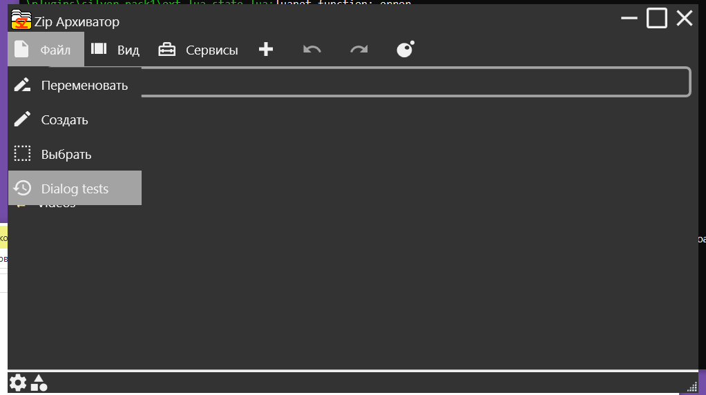

**szlua.ui.dialog** - представляет собой основной элемент создание диалоговых окон, которые останавливают работу основного окна до тех пор пока диалоговое не будет закрыто

**Подключение**
```lua
local dialog = require("szlua.ui.dialog")
```

В представленном ниже примере пустое диалоговое окно запускается при нажатии на элемент меню
```lua
script.events = {"file_menu_item_loaded_ret", "history_onclick"}

function script.on_file_menu_item_loaded_ret(args)
    local icons = require("szlua.media.icons")
    local menu = require("szlua.ui.menu")
    
    local menu_item = menu.ctor_element()
    menu_item.icon = icons.from_material("History")
    menu_item.title = "Dialog tests"
    menu_item.onclick_event = "history_onclick"
    
    return menu_item:build()
end

function script.on_history_onclick(args)
    local dialog = require("szlua.ui.dialog")
    local dialog_history = dialog.ctor()
    dialog_history:build() --Создание контрола
    dialog_history:show() --Вывод контрола на экран
end 
```

Перед показом диалогового окна нужно  его как и любой другой контрол нужно собрать в компонент приложения вызвав метод build 

Используйте метод show, чтобы вывести диалоговое окно на экран
Запустив этот код мы увидем элемент меню который мы создали, нажав на него откроется пустое диалоговое окно

