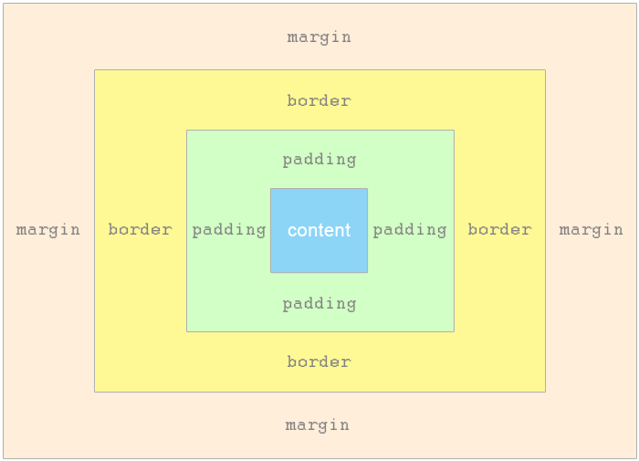

Очень многие `szlua.ui` копмоненты поддерживают `margin` и `padding` которые представляют собой соответственно внешний и внутренний отступ от компонента



Рассмотрим следующий пример
```lua
local button = require('szlua.ui.button');
local first = button.ctor();
first.margin = {10, 30, 50, 20}; --внешний оступ от кнопки где значения
--идут против  часовой стрелки: лево вверх вниз вправо
first:set_content("first button content");
first.padding = 20; --можно использоваать фиксированное значение для всех 4 значений вместо таблицы
local second = button.ctor();
second:set_content("second button content");
second.margin = {40, 10} --можно использоваать таблицу из двух значений
--где сначало идет право-лево а затем вниз-вверх
local third = button.ctor();
--Более читабельная версия где r - право, t - вверх,
--l и b лево и вниз соотвественно
third.margin = {
    r = 10,
    t = 10,
    b = 0.34, --можно использоваать дробные значения
    l = 5.34,
}
--Такая же версия для двух значений
third.padding = {
    r_l = 4,
    b_t = 4.32
}

local firth = button.ctor();
--Можно использовать названия сторон без сокращений
firth.margin = {
    right = 10,
    left = 4,
    top = 0,
    bottom = 20
}

firth.padding = {
    left_right = 20,
    top_bottom = 30
}

first:build()
second:build()
third:build()

--Компоновка
local stack_panel = require("szlua.ui.stackpanel");
local stack = stack_panel.ctor();
stack:add(first)
stack:add(second)
stack:add(third)
```